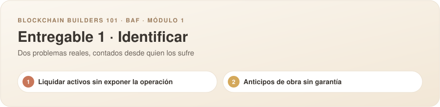
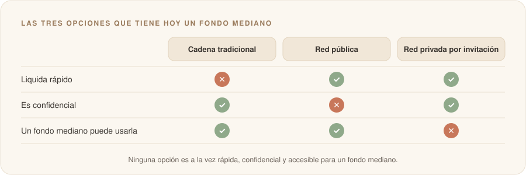
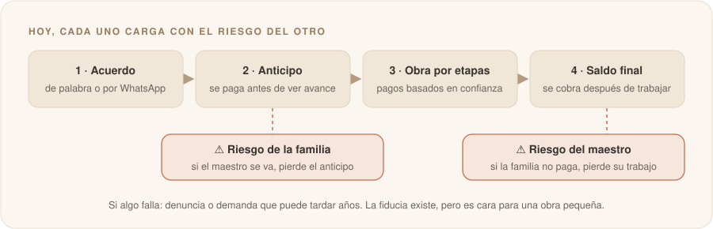

# Propuesta individual

**Nombre:** Emanuel Benavides León

**Usuario de GitHub:** [@EmanuXBe](https://github.com/EmanuXBe)

---

Traigo dos problemas. Cada uno responde las cuatro preguntas del entregable y se lee en unos dos minutos. Aquí no hay soluciones: solo el problema, contado desde quien lo vive.

| # | El problema | A quién le duele | Cuándo duele |
|:-:|---|---|---|
| **1** | Liquidar activos sin exponer la operación | Fondos y tesoreros que compran y venden entre ellos | Cuando el activo cambia de manos contra el pago |
| **2** | Anticipos de obra sin garantía | Familias que remodelan y maestros de obra | Cuando se entrega el anticipo y cuando se cobra el saldo |

---

## 1. Liquidar activos sin exponer la operación

### El problema

> **Las empresas y los fondos que compran y venden activos financieros entre sí necesitan liquidar sus operaciones rápido y sin pagarle a una cadena de intermediarios, pero hoy no pueden hacerlo sin mostrarle a su competencia qué compran, a qué precio y a quién.**

### ¿Quién lo sufre?

Piensa en un fondo de crédito que le compra facturas a cientos de pymes. Todo su negocio está en dos números: a qué descuento compra cada factura y cuánto volumen mueve. Si esos datos quedan a la vista, otro fondo puede ofrecerles a las mismas pymes un punto menos o adelantarse a sus movimientos. Lo mismo vive el tesorero de una empresa que invierte la caja en bonos, o una mesa que negocia participaciones de fondos.

El momento en que duele es la **liquidación**: el instante en que el activo pasa de una mano a otra a cambio del pago. Ahí es donde hoy toca escoger entre rapidez y discreción.

### ¿Cómo se resuelve hoy y qué cuesta?

Un fondo mediano tiene tres caminos, y cada uno le cobra algo distinto:

| Camino | Lo que le da | Lo que le cuesta |
|---|---|---|
| **La cadena tradicional:** corredor, custodio, depósito central (Deceval) y, si cruza fronteras, banco corresponsal | Discreción | Una comisión en cada eslabón, horario de oficina y por lo menos un día para cerrar. Mientras tanto, la plata está quieta y cada parte cruza los dedos para que la otra cumpla |
| **Las redes públicas** de activos digitales | Velocidad: cierran en segundos | Cualquiera ve el precio, el monto y con quién se negoció |
| **Las redes privadas por invitación** (Canton, donde están JPMorgan y DTCC) | Velocidad y discreción | Son un club de grandes bancos: a un fondo mediano latinoamericano no le llega la invitación |

📉 **Una señal de que esto frena el mercado:** en Stellar ya hay más de **US$3.000 millones** en activos del mundo real (bonos, fondos, crédito), pero la actividad sobre ellos ronda los **US$259 millones**. La gente compra y guarda, pero casi no negocia.

### ¿Por qué creo que blockchain podría aportar?

Es una intuición, todavía no una certeza. El problema tiene dos de los criterios que vimos en la Sesión 1:

| Criterio de la Sesión 1 | Cómo se ve en este problema |
|---|---|
| ✂️ Un intermediario que concentra la confianza | Hoy la confianza la ponen el corredor, el custodio y el depósito central. Cobran por garantizar que nadie se quede con el activo sin pagar, y además deciden cuándo y en qué horario se cierra |
| 🤝 Partes que no confían entre sí | Comprador y vendedor no se fían el uno del otro, y tampoco quieren que el resto del mercado se entere de lo que están haciendo |

> 🔍 **Lo que todavía tengo que averiguar:** cuánta plata pierde de verdad un fondo cuando su operación queda expuesta, si hay suficiente compraventa de estos activos para que el problema pese, y si quienes los emiten dejan que se negocien fuera de sus propios canales.

---

## 2. Anticipos de obra sin garantía

### El problema

> **Quien contrata una remodelación tiene que soltar plata antes de ver la obra, sin garantía de que el maestro la termine, y el maestro trabaja semanas sin garantía de que le paguen el saldo.**

### ¿Quién lo sufre?

Piensa en una pareja que recibe su apartamento en obra gris y tiene unos ahorros para pisos, baño y cocina. Le recomiendan un maestro, se ponen de acuerdo por WhatsApp y él pide un anticipo "para comprar el material". Desde ese momento todo depende de la palabra.

Del otro lado está el maestro, que pone su cuadrilla, su tiempo y a veces su propio material, y al final tiene que cobrarle el saldo a alguien que le puede poner peros a todo.

| Si sale mal… | Quién pierde |
|---|---|
| El maestro se desaparece con el anticipo | 🏠 La familia: la plata, el tiempo y muchas veces un arriendo extra mientras tanto |
| La familia no paga el saldo | 🧱 El maestro: semanas de trabajo, el jornal de su gente y los materiales |

### ¿Cómo se resuelve hoy y qué cuesta?

- **Con confianza:** un acuerdo de palabra o por WhatsApp, con suerte un contrato de una página, y pagos por etapas "según vaya viendo".
- **Cuando sale mal:** una denuncia por estafa o una demanda que puede tardar años, y no todos tienen el tiempo ni la plata para meterse en eso.
- **La opción formal**, una fiducia, existe, pero está pensada para proyectos grandes. Para una obra de pocos millones sale cara y lenta.

> 📺 Un reportaje de **Séptimo Día** mostró familias en Bogotá y el Valle del Cauca que pagaron remodelaciones que nunca se terminaron. Una entregó **28 millones de pesos** y apenas vio avance. Otra seguía **pagando arriendo un año después**, porque su casa no se podía habitar.

### ¿Por qué creo que blockchain podría aportar?

Es una intuición, todavía no una certeza. El problema tiene los tres criterios que vimos en la Sesión 1:

| Criterio de la Sesión 1 | Cómo se ve en este problema |
|---|---|
| 🤝 Partes que no confían entre sí | La familia y el maestro casi nunca se conocen de antes. Cada uno asume el riesgo de que el otro le quede mal |
| ✂️ Un intermediario que concentra la confianza | El único que podría poner esa confianza, la fiducia, no está al alcance de una obra pequeña. Entonces todo queda en la palabra |
| 🔒 Histórico inalterable | Cuando hay pelea, nadie puede probar qué se acordó, qué se hizo y qué se pagó. Es el chat de uno contra el chat del otro |

> 🔍 **Lo que todavía tengo que averiguar:** cada cuánto se va un maestro con el anticipo, qué porcentaje de la obra se suele pagar por adelantado y cuántos de estos líos terminan en una pérdida que nadie denuncia.

---

<b>Fuentes</b>

**Problema 1.** [JPMorgan lleva JPMD a Canton (CoinDesk)](https://www.coindesk.com/tech/2026/01/07/jpmorgan-to-issue-its-jpm-stablecoin-directly-on-privacy-focused-canton-network) · [Canton e instituciones (BlockEden)](https://blockeden.xyz/blog/2026/01/27/canton-network-jpmorgan-wall-street-privacy-blockchain-institutional-defi/) · [Brecha entre RWA y DeFi en Stellar (The Defiant)](https://thedefiant.io/converge/defi/stellar-rwa-3-billion-defi-tvl-gap-redstone-report)

**Problema 2.** Reportaje de Séptimo Día (Caracol Televisión) sobre remodelaciones pagadas y sin terminar.

