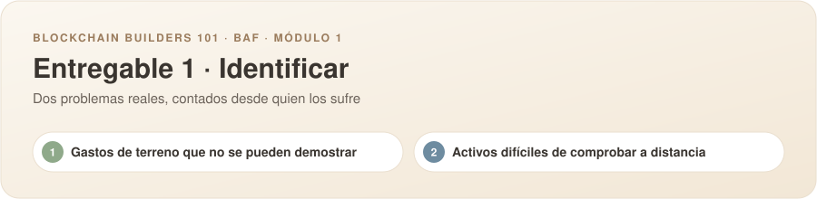
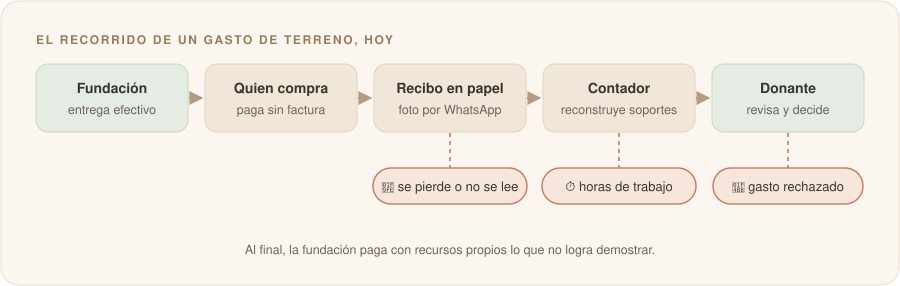
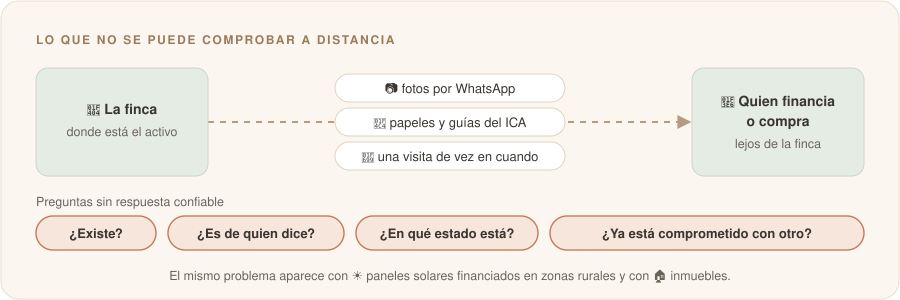

# Propuesta individual

**Nombre:** Jairo Enrique Amaya Celis

**Usuario de GitHub:** [@jairoamayac](https://github.com/jairoamayac)

---

Traigo dos problemas. Cada uno responde las cuatro preguntas del entregable y se lee en unos dos minutos. Aquí no hay soluciones: solo el problema, contado desde quien lo vive.

| # | El problema | A quién le duele | Cuándo duele |
|:-:|---|---|---|
| **1** | Gastos de terreno que no se pueden demostrar | Fundaciones que trabajan en zonas rurales | Cuando hay que rendirle cuentas al donante |
| **2** | Activos difíciles de comprobar a distancia | Ganaderos y quienes les prestan o les compran | Cuando alguien tiene que confiar en un animal que nunca ha visto |

---

## 1. Gastos de terreno que no se pueden demostrar

### El problema

> **Las fundaciones no logran demostrarle al donante en qué se fue la plata que su gente en terreno paga en efectivo a quienes no dan factura.**

### ¿Quién lo sufre?

Piensa en una coordinadora de una fundación que llega a una vereda a dictar un taller. Les compra los refrigerios a la señora de la tienda, le paga el flete a un señor con camioneta y el almuerzo de los asistentes en el restaurante del pueblo. Nadie ahí factura. Ella pide una firma en un papel, le toma foto y la manda por WhatsApp.

Semanas después, el contador tiene que convertir esos papeles en soportes que aguanten una revisión. Y al final, el donante (una agencia de cooperación o una empresa) tiene que decidir si les cree.

| Quién | Lo que vive |
|---|---|
| 🧭 **Quien compra en terreno** | Paga en efectivo y consigue el papel como puede |
| 🧮 **Quien lleva la contabilidad** | Arma los soportes semanas después, con lo que le llegó |
| 🏛️ **Quien donó** | Tiene que creer en algo que no puede comprobar |

### ¿Cómo se resuelve hoy y qué cuesta?

**Hoy:** la caja menor en efectivo y un recibo o una cuenta de cobro en papel, con la firma y la cédula de quien vendió. Si la fundación factura electrónicamente, la DIAN además le pide un **documento soporte electrónico** por cada compra a alguien que no factura (Resolución 000167 de 2021).

**Lo que cuesta:**

- ⏱️ Horas del contador persiguiendo papeles y armando soportes
- 🧾 Recibos que se mojan, se pierden o no se entienden
- 💸 Gastos que el donante no acepta y que la fundación termina pagando de su bolsillo

### ¿Por qué creo que blockchain podría aportar?

Es una intuición, todavía no una certeza. El problema tiene dos de los criterios que vimos en la Sesión 1:

| Criterio de la Sesión 1 | Cómo se ve en este problema |
|---|---|
| 🤝 Partes que no confían entre sí | En una misma compra intervienen la fundación, quien compra, quien vende, el contador y el donante, y cada uno tiene solo un pedazo de la historia: un papel, una foto, una planilla |
| 🔒 Histórico inalterable | El soporte es un papel o una foto que se puede perder, cambiar o rehacer después, y el donante no tiene cómo darse cuenta |

> 🔍 **Lo que todavía tengo que averiguar:** cuánta plata de un proyecto se mueve por caja menor, cuántos gastos le rechaza un donante a una fundación en un año y cuántas horas se le van al contador armando soportes.

---

## 2. Activos difíciles de comprobar a distancia

### El problema

> **Quien presta, compra o asegura un activo físico (una res, un panel solar, una casa) no tiene cómo comprobar desde lejos que existe, que es de quien dice y que está como se lo cuentan.**

### ¿Quién lo sufre?

Piensa en un ganadero del Casanare con ochenta novillos. Quiere un crédito y su garantía es el ganado, pero el banco está a horas de la finca y no tiene cómo saber si esas reses existen, si están sanas o si ya las ofreció como garantía en otra parte. Y si quiere venderle carne a Europa, el comprador además le exige demostrar que no salió de tierra deforestada.

| Lado | Quién | Qué necesita |
|---|---|---|
| Quien tiene el activo | Pequeños y medianos ganaderos | Un crédito con su ganado como garantía, venderle a un frigorífico exportador o recibir inversión |
| Quien tiene que confiar | Bancos, fondos, inversionistas y compradores en Europa | Saber que el animal existe, que está sano y que no viene de tierra deforestada |

**Por qué ahora:** desde el **30 de diciembre de 2026**, el reglamento europeo contra la deforestación (EUDR) exige demostrar con coordenadas y evidencia técnica que la carne no viene de tierras deforestadas, y la **Ley 2585 de 2026** crea en Colombia un sistema nacional de trazabilidad ganadera. Lo mismo pasa con ☀️ los paneles solares financiados en zonas rurales y con 🏠 las casas, cuyo certificado de tradición dice quién es el dueño, pero no en qué estado está el inmueble.

### ¿Cómo se resuelve hoy y qué cuesta?

| Cómo se resuelve hoy | Lo que cuesta |
|---|---|
| Visitas a la finca | Viajes largos y caros, que no se pueden hacer seguido |
| Cuadernos, papeles y hojas de cálculo | Un crédito que se decide más por confianza que por datos |
| Chapetas, guías de movilización del ICA y fotos por WhatsApp | El riesgo de que el mismo animal respalde dos créditos |
| Certificados de terceros | Para el ganadero: quedarse sin crédito formal o sin poder venderle a Europa |

### ¿Por qué creo que blockchain podría aportar?

Es una intuición, todavía no una certeza. El problema tiene dos de los criterios que vimos en la Sesión 1:

| Criterio de la Sesión 1 | Cómo se ve en este problema |
|---|---|
| 🔒 Histórico inalterable | La vida del animal (cuándo nació, qué vacunas tiene, por dónde se movió, a quién se vendió) está regada en papeles de distintas personas, y esos papeles se pierden o se cambian |
| 🤝 Partes que no confían entre sí | El ganadero, el veterinario, el ICA, el banco y el comprador tienen cada uno su propia versión, y ninguno sabe si ese animal ya está comprometido con alguien más |

Son las mismas preguntas del ejemplo de la Sesión 1: ¿es real?, ¿ya lo vendieron?, ¿alguien más tiene copia?

> 🔍 **Lo que todavía tengo que averiguar:** lo más difícil está en la última milla, es decir, en saber que lo que se reporta desde la finca es lo que de verdad pasa con el animal. También falta medir cuánto crédito deja de recibir un ganadero por no poder demostrar su ganado.

---

<b>Fuentes</b>

**Problema 1.** [Documento soporte en adquisiciones a no obligados a facturar (DIAN)](https://micrositios.dian.gov.co/sistema-de-facturacion-electronica/documento-soporte-adquisiciones-no-obligados) · [Resolución DIAN 000167 de 2021](https://normograma.mintic.gov.co/mintic/docs/pdf/resolucion_dian_0167_2021.pdf)

**Problema 2.** [Ley de trazabilidad ganadera (Cambio)](https://cambiocolombia.com/medio-ambiente/articulo/2026/6/ley-de-trazabilidad-ganadera-ya-es-una-realidad-permitira-rastrear-el-origen-de-la-carne-y-combatir-la-deforestacion-en-colombia) · [EUDR y exportaciones colombianas (El Productor)](https://elproductor.com/2026/05/colombia-cafe-cacao-y-ganaderia-asi-cambiaran-las-exportaciones-colombianas-con-la-nueva-norma-ambiental-europea/) · [Colombia ante el EUDR (Mundo Agropecuario)](https://mundoagropecuario.com/colombia-ajusta-sus-exportaciones-agropecuarias-ante-la-nueva-norma-europea-contra-la-deforestacion/)

