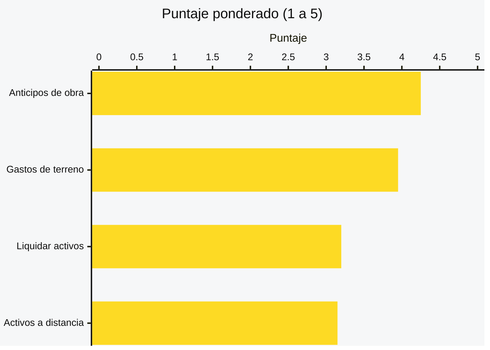
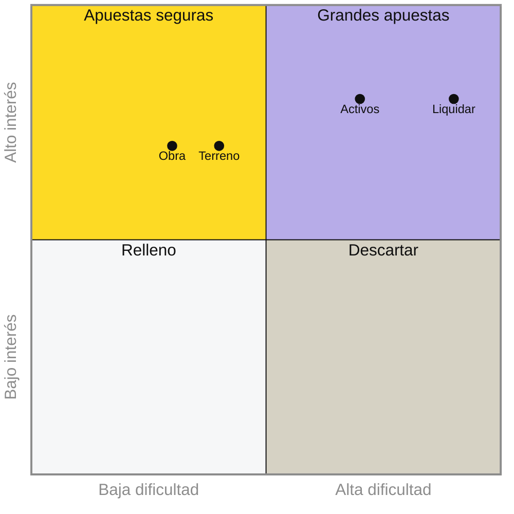
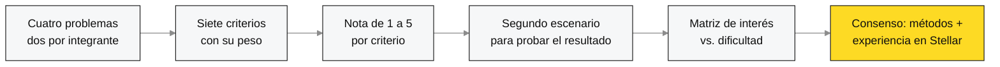
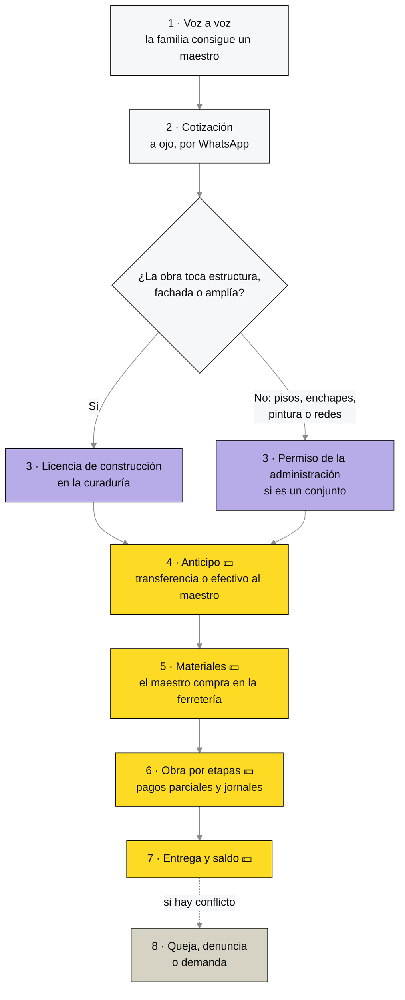

# Problem Brief

## Decisión del problema

### Problema elegido

> **Anticipos de obra sin garantía.** Quien contrata una remodelación tiene que soltar plata antes de ver la obra, sin garantía de que el maestro la termine, y el maestro trabaja semanas sin garantía de que le paguen el saldo.

**Lo propuso:** Emanuel Benavides ([ver su propuesta](EmanuelBenavides.md)).

### Por qué elegimos este

Es el único de los cuatro problemas que cumple los **tres criterios de la Sesión 1**, y además fue el que mejor salió en nuestro análisis.

| Criterio de la Sesión 1 | Anticipos de obra | Gastos de terreno | Liquidar activos | Activos a distancia |
|---|:-:|:-:|:-:|:-:|
| 🤝 Partes que no confían entre sí comparten un registro | ✅ | ✅ | ✅ | ✅ |
| 🔒 Histórico inalterable | ✅ | ✅ | ➖ | ✅ |
| ✂️ Eliminar un intermediario que concentra la confianza | ✅ | ➖ | ✅ | ➖ |

Lo que inclinó la balanza:

- **Cumple los tres criterios.** La familia y el maestro casi nunca se conocen de antes. El único intermediario que podría dar confianza, la fiducia, no está al alcance de una obra pequeña. Y cuando hay pelea, nadie puede probar qué se acordó, qué se hizo y qué se pagó.
- **El dolor es fuerte y muy humano.** De un lado están los ahorros de una familia; del otro, semanas de trabajo de un maestro y su cuadrilla.
- **Lo podemos validar ya.** Familias que remodelan y maestros de obra están en nuestro círculo cercano, y conocemos el sector por nuestra investigación sobre transformación digital en la construcción.

Calificamos los cuatro problemas con siete criterios ponderados (de 1 a 5):

<b>Ver los criterios, los pesos y las notas</b>

| Criterio | Peso | Anticipos de obra | Gastos de terreno | Liquidar activos | Activos a distancia |
|---|:-:|:-:|:-:|:-:|:-:|
| Pertinencia según los criterios de la Sesión 1 | 20 % | **5** | 3 | 4 | 4 |
| Acceso a usuarios para validar esta semana | 15 % | 4 | **5** | 2 | 2 |
| Qué tan fuerte es el dolor para quien lo sufre | 15 % | **5** | 4 | 3 | 4 |
| Se puede construir y demostrar en cuatro semanas | 15 % | **5** | 4 | 2 | 3 |
| Encaje con las prioridades de Stellar en 2026 | 15 % | 3 | 4 | **5** | 4 |
| Diferencia frente a lo que ya existe en Stellar | 10 % | 2 | **3** | **3** | 2 |
| Conocimiento y red del equipo en el sector | 10 % | **5** | **5** | 3 | 2 |
| **Puntaje ponderado** | | **4,25** | 3,95 | 3,20 | 3,15 |

Con un segundo escenario, que le da más peso a Stellar y a la diferenciación, el orden se mantiene: Anticipos de obra 3,95 · Gastos de terreno 3,85 · Liquidar activos 3,50 · Activos a distancia 3,20.

Y los ubicamos según cuánto interés generan y qué tan difícil sería abordarlos en cinco semanas:

Anticipos de obra cae en **apuestas seguras**: genera interés y es abordable en el tiempo del bootcamp.

> ⚠️ **Lo que tenemos que vigilar:** es el problema con menos diferencia frente a lo que ya existe (2 de 5), porque en Stellar ya hay proyectos alrededor de pagos condicionados. Por eso nuestro foco estará en quien sufre el problema: familias y maestros de obra que no saben, ni tienen por qué saber, de tecnología.

### Propuestas descartadas

| Problema | Lo propuso | Puntaje | Por qué lo descartamos |
|---|---|:-:|---|
| Gastos de terreno que no se pueden demostrar | Jairo | 3,95 | Quedó muy cerca y es el que tiene mejor acceso a usuarios. Lo descartamos porque su pertinencia es la más débil: buena parte del problema se podría resolver con un software tradicional. **Queda como plan B.** |
| Liquidar activos sin exponer la operación | Emanuel | 3,20 | Es el que más le interesa a Stellar, pero el más difícil: llegar a los fondos para validar toma tiempo, la compraventa de estos activos todavía es baja y depende de que los emisores lo permitan. |
| Activos difíciles de comprobar a distancia | Jairo | 3,15 | Tiene urgencia real por la norma europea contra la deforestación (EUDR), pero no tenemos acceso a ganaderos y el reto de la última milla no se resuelve en cinco semanas. |

### Cómo tomamos la decisión

Elegimos **por consenso**, apoyados en dos métodos de selección (el **análisis de decisiones multicriterio** y la **matriz de interés vs. dificultad**) y en nuestra **experiencia construyendo en la red de Stellar**.

1. **Cada uno propuso dos problemas** por separado, en su propuesta individual.
2. **Acordamos siete criterios con su peso**, a partir de lo que exige este Problem Brief y de lo que necesitamos para llegar al Demo Day.
3. **Calificamos cada problema de 1 a 5** en cada criterio y calculamos el puntaje ponderado.
4. **Probamos un segundo escenario**, con más peso para Stellar y la diferenciación, para ver si el ganador cambiaba. No cambió.
5. **Ubicamos los cuatro en la matriz** de interés vs. dificultad.
6. **Revisamos el resultado juntos** y, sumando nuestra experiencia en la red de Stellar, elegimos por consenso Anticipos de obra, con Gastos de terreno como plan B.

---

## Problem Brief

### Encabezado

**BB101 · Anticipos de obra sin garantía**

> En las obras de construcción, desde un edificio hasta la remodelación de una casa, la plata se entrega antes de poder verificar el trabajo hecho, y cuando algo falla nadie puede probar qué se acordó, qué se hizo y qué se pagó.

### Equipo y roles

| Integrante | GitHub | Rol |
|---|---|---|
| Emanuel Benavides León | [@EmanuXBe](https://github.com/EmanuXBe) | Producto y desarrollo: descubrimiento del problema, diseño de la experiencia y construcción técnica |
| Jairo Enrique Amaya Celis | [@jairoamayac](https://github.com/jairoamayac) | Usuarios y negocio: entrevistas, validación con familias y maestros, y modelo de negocio |

- **Responsable de las entregas:** Emanuel Benavides.
- **Coordinación interna:** grupo de WhatsApp del equipo para el día a día y el canal de Discord del bootcamp para las entregas.

### Problema y evidencia

> **Quien contrata una remodelación tiene que soltar plata antes de ver la obra, sin garantía de que el maestro la termine, y el maestro trabaja semanas sin garantía de que le paguen el saldo.**

**Contexto.** En Colombia, buena parte de las remodelaciones de vivienda (terminar un apartamento entregado en obra gris, cambiar pisos, rehacer un baño o una cocina) las hace un maestro de obra contratado por recomendación, con un acuerdo de palabra o por WhatsApp, en un país donde el 55,1 % de las personas ocupadas es informal (DANE, junio de 2026).

**Frecuencia y alcance.** Pasa en cada remodelación que arranca con un anticipo, y el anticipo es la costumbre. Lo que llega a las autoridades es apenas la punta: la Superintendencia de Industria y Comercio registró **75 quejas** por incumplimiento en remodelaciones de vivienda entre enero de 2022 y mayo de 2026. Creemos que la mayoría de los casos nunca se denuncia, porque una queja o una demanda cuesta más tiempo y plata de lo que se perdió.

**Evidencia.**

- 📺 Un reportaje de **Séptimo Día** mostró familias en Bogotá y el Valle del Cauca con remodelaciones pagadas y sin terminar. Una entregó **28 millones de pesos** y apenas vio avance; otra seguía pagando arriendo un año después porque su casa no se podía habitar.
- 🧑‍⚖️ En ese mismo reportaje, los expertos recomiendan que, **antes de dar cualquier anticipo**, se verifique al contratista y se exija una póliza de cumplimiento. Es decir, el anticipo es justo el punto donde se rompe la confianza.
- 🏠 **Experiencia cercana:** en nuestro círculo hay familias que han remodelado y maestros de obra que han trabajado sin garantía de pago. Esta semana los entrevistamos para medir qué tan seguido pasa y cuánto se pierde.

### Usuario y actores

**Quién sufre el problema.** Son dos, y cada uno carga con el riesgo del otro:

| Usuario | Qué necesita resolver | Cómo lo resuelve hoy | Qué le cuesta |
|---|---|---|---|
| 🏠 **La familia** que remodela | Pagar solo por el trabajo que de verdad se hizo y tener cómo probarlo | Confía en la recomendación, da el anticipo y paga por etapas "según vaya viendo" | La plata del anticipo si el maestro se va, meses de retraso, arriendo extra y años de pleito si decide demandar |
| 🧱 **El maestro de obra** | Tener plata para empezar (materiales y jornales) y la certeza de que le pagarán el saldo | Pide un anticipo y cobra por etapas a medida que avanza | Semanas de trabajo, los jornales de su gente y los materiales si la familia no paga o le pone peros a todo |

**Los demás actores del flujo:**

| Actor | Papel |
|---|---|
| 👷 Cuadrilla de ayudantes | Trabaja en la obra y cobra el jornal al maestro, no a la familia |
| 🔩 Ferretería o depósito | Vende los materiales, con plata del anticipo o directamente a la familia |
| 🏦 Banco o billetera digital | Mueve la plata entre la familia y el maestro; no sabe nada de la obra |
| 🏢 Administración del conjunto | Autoriza la obra, los horarios y el ingreso de materiales cuando es propiedad horizontal |
| 🏛️ Curaduría urbana | Expide la licencia cuando la obra toca la estructura, la fachada o amplía el inmueble |
| 🛡️ Aseguradora | Vende pólizas de cumplimiento, que casi nadie compra para una obra pequeña |
| ⚖️ SIC, Fiscalía o juez | Reciben la queja, la denuncia o la demanda cuando todo falla |

### Flujo actual de valor

Así se mueven hoy la plata (💵), la información y el trabajo en una remodelación típica:

1. **Voz a voz.** La familia consigue un maestro por recomendación de un vecino o un familiar.
2. **Cotización.** El maestro visita, calcula a ojo y manda el precio por WhatsApp. No suele haber contrato escrito.
3. **Permisos (obligación normativa).** Si la obra modifica la estructura, la fachada o amplía el inmueble, necesita **licencia de construcción** en una curaduría (Decreto 1077 de 2015). Si son reparaciones locativas como pisos, enchapes, pintura o redes, no necesita licencia (Ley 810 de 2003, art. 8), pero en un conjunto sí hace falta el permiso de la administración.
4. **Anticipo.** La familia transfiere o entrega en efectivo una parte grande del valor, antes de ver cualquier avance.
5. **Materiales.** El maestro compra en la ferretería con esa plata, mezclada con la de su mano de obra.
6. **Obra por etapas.** La familia hace pagos parciales "según vaya viendo" y el maestro les paga los jornales a sus ayudantes.
7. **Entrega y saldo.** La familia revisa y paga lo que falta, o lo retiene si no está conforme.
8. **Conflicto.** Si algo sale mal, la salida es una queja ante la SIC, una denuncia por estafa o una demanda.

### Fricciones identificadas

| # | Fricción | Paso | Qué la causa | A quién afecta |
|:-:|---|:-:|---|---|
| F1 | **El anticipo viaja sin respaldo** | 4 | Se paga antes de ver avance, y la única garantía formal (póliza o fiducia) es cara para una obra pequeña | 🏠 Familia |
| F2 | **Nadie sabe cuánto va de verdad** | 6 | No hay una forma acordada de medir el avance; quedan fotos sueltas en el chat | 🏠🧱 Ambos |
| F3 | **La plata de materiales se mezcla** | 5 | El anticipo cubre material y mano de obra sin separar, y no hay soportes | 🏠 Familia |
| F4 | **El saldo se retiene o se regatea** | 7 | No hay un registro común de lo acordado; la familia le puede poner peros a todo | 🧱 Maestro y cuadrilla |
| F5 | **La pelea no tiene pruebas y dura años** | 8 | Los acuerdos fueron de palabra o por chat, y la justicia es lenta y costosa | 🏠🧱 Ambos |

F1 y F2 están en el origen de las demás: como la plata se mueve sin que el avance esté verificado, el saldo termina en discusión (F4) y la disputa no tiene pruebas (F5).

### Oportunidad e hipótesis

**La oportunidad que priorizamos:** amarrar el pago al avance verificado, es decir, F1 y F2 juntas.

**Por qué esta y no otra:** es la raíz del problema. Si cada peso se moviera solo cuando las dos partes reconocen que la obra avanzó, el anticipo dejaría de ser un salto al vacío, el saldo no tendría por qué regatearse y, en una pelea, habría con qué demostrar lo que pasó. Además es la que más pesa para los dos usuarios a la vez: la familia arriesga su plata y el maestro su trabajo en el mismo punto.

**Nuestra hipótesis inicial.** Creemos que un registro compartido podría cambiar la experiencia de esta forma:

| Para | Hoy | Lo que cambiaría |
|---|---|---|
| 🏠 La familia | Entrega el anticipo y cruza los dedos | Sabría que su plata solo avanza cuando la obra avanza, y tendría la historia completa de lo acordado y lo pagado |
| 🧱 El maestro | Empieza sin saber si la plata del saldo existe | Sabría desde el primer día que la plata de la obra está ahí y que le llegará a medida que entregue |
| ⚖️ Ambos, si hay pelea | Es un chat contra otro | Habría un registro que ninguno de los dos pudo cambiar después |

Es una intuición, todavía no una certeza: la vamos a poner a prueba en las entrevistas de esta semana.

### Criterio de pertinencia

**¿Por qué no basta una base de datos o una app tradicional?** Porque la pregunta clave es **quién la controla**.

- Si el registro lo lleva **el maestro** o **la familia**, la otra parte no tiene por qué creerle.
- Si lo lleva **una plataforma**, que además guarda la plata, aparece un nuevo intermediario que concentra la confianza y cobra por ello. Eso ya existe (la fiducia y la póliza de cumplimiento), y por caro no llega a las obras pequeñas.
- Integrar los sistemas existentes tampoco resuelve nada: hoy no hay sistemas que integrar, solo chats, transferencias y papeles.

El caso cumple los **tres criterios de la Sesión 1**:

| Criterio | Cómo aplica |
|---|---|
| 🤝 Partes que no confían entre sí comparten un registro | La familia y el maestro casi nunca se conocen de antes y cada uno asume el riesgo de que el otro incumpla |
| 🔒 Histórico inalterable | Lo acordado, lo aprobado y lo pagado tiene que quedar fijo, porque es la prueba si hay disputa |
| ✂️ Eliminar un intermediario que concentra la confianza | Hoy el único tercero que da garantías (fiducia o aseguradora) es inaccesible para una remodelación |

Siguiendo la regla de la Sesión 1, **en la red solo iría lo que varias partes necesitan verificar**: los montos, los hitos acordados, las aprobaciones y la huella de la evidencia. Las fotos, los nombres, las cédulas y las conversaciones se quedan en una base de datos tradicional.

### Supuestos y riesgos

**Supuestos que tendrían que ser ciertos:**

| # | Supuesto | Qué lo invalidaría |
|:-:|---|---|
| S1 | **El problema es frecuente**, no solo un puñado de casos de televisión | Que en las entrevistas la mayoría de familias y maestros cuente que sus obras terminaron bien solo con la confianza |
| S2 | **La familia y el maestro aceptarían comprometer la plata desde el inicio** y moverla por etapas | Que el maestro necesite libre todo el anticipo para materiales y no acepte trabajar de otra forma |
| S3 | **Las peleas son por avance y pago, no solo por calidad** | Que la mayoría de conflictos sean sobre si algo quedó "bien hecho", algo subjetivo que un registro de avance no resuelve |

**Riesgos:**

- **Adopción.** Familias y maestros no saben, ni tienen por qué saber, de tecnología. Si la experiencia no es tan simple como mandar un WhatsApp, no la van a usar.
- **Competencia.** En Stellar ya existen proyectos alrededor de pagos condicionados. Nuestra diferencia tiene que estar en el usuario: la familia y el maestro de obra colombianos.
- **Regulación.** Guardar plata de terceros puede tener implicaciones legales en Colombia. Lo vamos a revisar antes de diseñar.

<b>Fuentes</b>

- Reportaje de Séptimo Día (Caracol Televisión) sobre remodelaciones pagadas y sin terminar, con cifras de la Superintendencia de Industria y Comercio (quejas entre enero de 2022 y mayo de 2026) y recomendaciones de expertos.
- DANE, Gran Encuesta Integrada de Hogares, informalidad laboral a junio de 2026, vía [Portafolio](https://www.portafolio.co/economia/mientras-que-el-desempleo-en-colombia-baja-de-los-dos-digitos-la-informalidad-no-cede-del-491084).
- Reparaciones locativas y licencias de construcción, Decreto 1077 de 2015 y Ley 810 de 2003, art. 8, según [concepto de la Curaduría Urbana 3 de Bogotá](https://curaduria3bogota.com/wp-content/uploads/2024/12/CONCEPTO-R23-3-0240.pdf).

