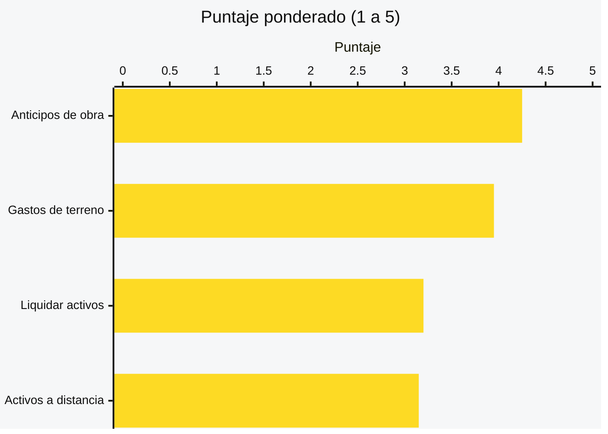
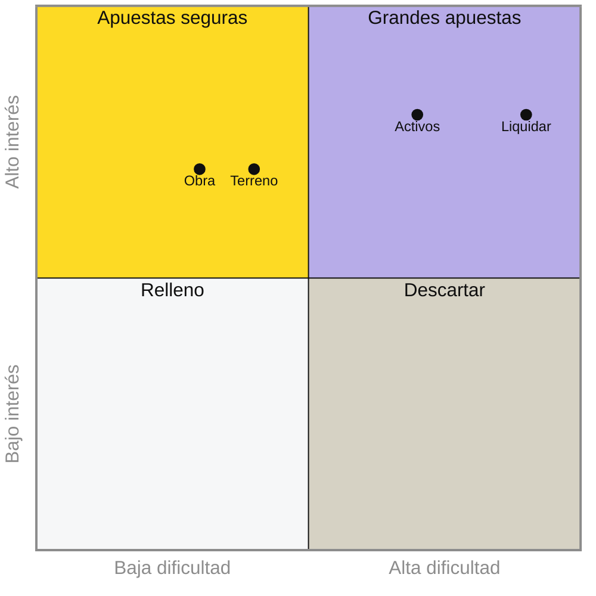
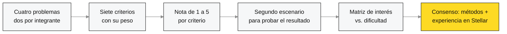

# Problem Brief

## Decisión del problema

### Problema elegido

> **Anticipos de obra sin garantía.** Quien contrata una remodelación tiene que soltar plata antes de ver la obra, sin garantía de que el maestro la termine, y el maestro trabaja semanas sin garantía de que le paguen el saldo.

**Lo propuso:** Emanuel Benavides ([ver su propuesta](EmanuelBenavides.md)).

### Por qué elegimos este

Es el único de los cuatro problemas que cumple los **tres criterios de la Sesión 1**, y además fue el que mejor salió en nuestro análisis.

| Criterio de la Sesión 1 | Anticipos de obra | Gastos de terreno | Liquidar activos | Activos a distancia |
|---|:-:|:-:|:-:|:-:|
| 🤝 Partes que no confían entre sí comparten un registro | ✅ | ✅ | ✅ | ✅ |
| 🔒 Histórico inalterable | ✅ | ✅ | ➖ | ✅ |
| ✂️ Eliminar un intermediario que concentra la confianza | ✅ | ➖ | ✅ | ➖ |

Lo que inclinó la balanza:

- **Cumple los tres criterios.** La familia y el maestro casi nunca se conocen de antes. El único intermediario que podría dar confianza, la fiducia, no está al alcance de una obra pequeña. Y cuando hay pelea, nadie puede probar qué se acordó, qué se hizo y qué se pagó.
- **El dolor es fuerte y muy humano.** De un lado están los ahorros de una familia; del otro, semanas de trabajo de un maestro y su cuadrilla.
- **Lo podemos validar ya.** Familias que remodelan y maestros de obra están en nuestro círculo cercano, y conocemos el sector por nuestra investigación sobre transformación digital en la construcción.

Calificamos los cuatro problemas con siete criterios ponderados (de 1 a 5):

<b>Ver los criterios, los pesos y las notas</b>

| Criterio | Peso | Anticipos de obra | Gastos de terreno | Liquidar activos | Activos a distancia |
|---|:-:|:-:|:-:|:-:|:-:|
| Pertinencia según los criterios de la Sesión 1 | 20 % | **5** | 3 | 4 | 4 |
| Acceso a usuarios para validar esta semana | 15 % | 4 | **5** | 2 | 2 |
| Qué tan fuerte es el dolor para quien lo sufre | 15 % | **5** | 4 | 3 | 4 |
| Se puede construir y demostrar en cuatro semanas | 15 % | **5** | 4 | 2 | 3 |
| Encaje con las prioridades de Stellar en 2026 | 15 % | 3 | 4 | **5** | 4 |
| Diferencia frente a lo que ya existe en Stellar | 10 % | 2 | **3** | **3** | 2 |
| Conocimiento y red del equipo en el sector | 10 % | **5** | **5** | 3 | 2 |
| **Puntaje ponderado** | | **4,25** | 3,95 | 3,20 | 3,15 |

Con un segundo escenario, que le da más peso a Stellar y a la diferenciación, el orden se mantiene: Anticipos de obra 3,95 · Gastos de terreno 3,85 · Liquidar activos 3,50 · Activos a distancia 3,20.

Y los ubicamos según cuánto interés generan y qué tan difícil sería abordarlos en cinco semanas:

Anticipos de obra cae en **apuestas seguras**: genera interés y es abordable en el tiempo del bootcamp.

> ⚠️ **Lo que tenemos que vigilar:** es el problema con menos diferencia frente a lo que ya existe (2 de 5), porque en Stellar ya hay proyectos alrededor de pagos condicionados. Por eso nuestro foco estará en quien sufre el problema: familias y maestros de obra que no saben, ni tienen por qué saber, de tecnología.

### Propuestas descartadas

| Problema | Lo propuso | Puntaje | Por qué lo descartamos |
|---|---|:-:|---|
| Gastos de terreno que no se pueden demostrar | Jairo | 3,95 | Quedó muy cerca y es el que tiene mejor acceso a usuarios. Lo descartamos porque su pertinencia es la más débil: buena parte del problema se podría resolver con un software tradicional. **Queda como plan B.** |
| Liquidar activos sin exponer la operación | Emanuel | 3,20 | Es el que más le interesa a Stellar, pero el más difícil: llegar a los fondos para validar toma tiempo, la compraventa de estos activos todavía es baja y depende de que los emisores lo permitan. |
| Activos difíciles de comprobar a distancia | Jairo | 3,15 | Tiene urgencia real por la norma europea contra la deforestación (EUDR), pero no tenemos acceso a ganaderos y el reto de la última milla no se resuelve en cinco semanas. |

### Cómo tomamos la decisión

Elegimos **por consenso**, apoyados en dos métodos de selección (el **análisis de decisiones multicriterio** y la **matriz de interés vs. dificultad**) y en nuestra **experiencia construyendo en la red de Stellar**.

1. **Cada uno propuso dos problemas** por separado, en su propuesta individual.
2. **Acordamos siete criterios con su peso**, a partir de lo que exige este Problem Brief y de lo que necesitamos para llegar al Demo Day.
3. **Calificamos cada problema de 1 a 5** en cada criterio y calculamos el puntaje ponderado.
4. **Probamos un segundo escenario**, con más peso para Stellar y la diferenciación, para ver si el ganador cambiaba. No cambió.
5. **Ubicamos los cuatro en la matriz** de interés vs. dificultad.
6. **Revisamos el resultado juntos** y, sumando nuestra experiencia en la red de Stellar, elegimos por consenso Anticipos de obra, con Gastos de terreno como plan B.

---

## Problem Brief

### Encabezado

> Nombre del proyecto y una frase que describa el problema. Extensión: breve.

Las construcciones enfrentan problemas por el desorden en los pagos a sus trabajadores, y la verificación del trabajo hecho, este problema se traslada a las obras incluso familiares.

### Equipo y roles

> Integrantes con su usuario de GitHub, rol asumido por cada persona, responsable de las entregas y canal de coordinación interna. Extensión: breve.

Escriban aquí su respuesta.

### Problema y evidencia

> Enunciado del problema en una frase, sin mencionar blockchain. Contexto, frecuencia y alcance. Evidencia mínima de que el problema existe: observación directa, experiencia propia, conversaciones o fuentes consultadas, con enlace o cita cuando aplique. Extensión: 150–300 palabras.

Escriban aquí su respuesta.

### Usuario y actores

> Quién sufre el problema y qué necesita resolver. Cómo lo resuelve hoy y qué le cuesta en dinero, tiempo o esfuerzo. Demás actores que intervienen en el flujo, con el papel que cumple cada uno. Extensión: 150–300 palabras.

Escriban aquí su respuesta.

### Flujo actual de valor

> Recorrido paso a paso de cómo se mueve hoy el dinero, la información o el activo, desde el origen hasta el destino. Diagrama o secuencia numerada, con los intermediarios explícitos. Señalar si algún paso responde a una obligación normativa. Extensión: 150–300 palabras.

Escriban aquí su respuesta.

### Fricciones identificadas

> Puntos concretos donde el flujo falla, se encarece o se demora. Cada fricción indica en qué paso ocurre, qué la causa y a quién afecta. Extensión: 150–300 palabras.

Escriban aquí su respuesta.

### Oportunidad e hipótesis

> Oportunidad priorizada entre las fricciones identificadas, con el motivo de la elección. Hipótesis inicial de por qué blockchain podría mejorar ese punto, expresada en términos de qué cambiaría para el usuario. Extensión: 150–300 palabras.

Escriban aquí su respuesta.

### Criterio de pertinencia

> Justificación de por qué el caso requiere un registro distribuido y no una base de datos tradicional o una integración entre sistemas existentes. Debe apoyarse en al menos uno de los criterios de la Sesión 1: varias partes que no confían entre sí necesitan compartir un mismo registro, el histórico no puede alterarse, o se elimina un intermediario que hoy concentra la confianza. Extensión: 150–300 palabras.

Escriban aquí su respuesta.

### Supuestos y riesgos

> Dos o tres supuestos que tendrían que ser ciertos para que la hipótesis funcione, y qué podría invalidarla. Extensión: 150–300 palabras.

Escriban aquí su respuesta.
