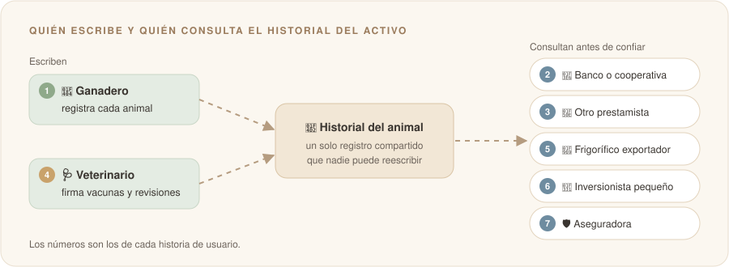

# Historias de usuario individuales

**Nombre:** Jairo Enrique Amaya Celis

**Usuario de GitHub:** [@jairoamayac](https://github.com/jairoamayac)

---

Parto del problema que traje en la semana 1: **quien presta, compra o invierte en un activo físico no tiene cómo comprobar desde lejos que existe, que es de quien dice y que está como se lo cuentan**. Tomo el ganado como caso principal porque es donde más duele hoy, pero las mismas historias aplican a un panel solar financiado en zona rural o a una casa.

Escribí una historia por cada persona que aparece en ese recorrido: quien tiene el activo, quien da fe de lo que le pasa y quienes tienen que confiar en él sin haberlo visto.

---

## Mis historias de usuario

1. Como **ganadero** quiero **registrar cada animal con su chapeta, sus vacunas y sus movimientos en un solo historial** para **poder usar mi ganado como garantía de un crédito formal sin que me pidan una visita cada vez**.
2. Como **analista de crédito de un banco o una cooperativa** quiero **consultar desde la oficina el historial verificado de los animales que me ofrecen en garantía** para **aprobar el crédito con datos y no solo por confianza en el cliente**.
3. Como **entidad que presta** quiero **saber si un animal ya está respaldando otro crédito** para **no financiar dos veces el mismo activo**.
4. Como **veterinario que atiende la finca** quiero **firmar cada vacunación y cada revisión desde el celular** para **que mi registro sirva como evidencia y nadie lo pueda cambiar después**.
5. Como **frigorífico que exporta carne** quiero **comprobar de qué finca viene cada animal, con sus coordenadas** para **demostrarle al comprador europeo que la carne no sale de tierra deforestada**.
6. Como **persona que invierte poco en un proyecto productivo** quiero **ver el estado real del activo que respalda mi inversión** para **confiar en que existe y está como me lo cuentan**.
7. Como **aseguradora agropecuaria** quiero **recibir un aviso cuando un animal asegurado muere, se enferma o sale de la finca** para **pagar o rechazar un reclamo con evidencia y no con la palabra de una sola parte**.

### Vistas por rol

| # | Rol | Lo que quiere hacer | Lo que gana | Pregunta de la semana 1 que responde |
|:-:|---|---|---|---|
| 1 | 🐄 Ganadero | Llevar un historial único de cada animal | Crédito formal con su ganado como garantía | ¿Es de quien dice? |
| 2 | 🏦 Banco o cooperativa | Consultar el historial desde la oficina | Decidir con datos, sin viajar | ¿Existe? |
| 3 | 🔎 Otro prestamista | Ver si el animal ya está comprometido | No prestar dos veces sobre lo mismo | ¿Ya está comprometido con otro? |
| 4 | 🩺 Veterinario | Firmar vacunas y revisiones | Que su palabra valga como prueba | ¿En qué estado está? |
| 5 | 🥩 Frigorífico exportador | Comprobar el origen con coordenadas | Seguir vendiéndole a Europa (EUDR) | ¿De dónde viene? |
| 6 | 🌱 Inversionista pequeño | Ver el estado del activo que lo respalda | Invertir sin tener que creer a ciegas | ¿Existe y está bien? |
| 7 | 🛡️ Aseguradora | Recibir avisos de muerte, enfermedad o salida | Resolver reclamos con evidencia | ¿Qué le pasó y cuándo? |

---

## La más importante y por qué

| Orden de importancia | Historia # | Por qué |
| :---: | :---: | --- |
| 1 (la más importante) | 1 | Todo arranca aquí. Si el ganadero no registra a sus animales, no hay historial que nadie pueda consultar. Además es quien más gana: hoy se queda sin crédito formal porque no puede demostrar lo que tiene. |
| 2 | 3 | Es la pregunta que hoy nadie puede responder: si ese animal ya respalda otro crédito. Es justo donde un registro compartido le gana a que cada entidad tenga su propia hoja de cálculo. |
| 3 | 2 | El banco es quien pone la plata. Si no puede consultar y confiar en el historial desde lejos, el ganadero sigue sin crédito aunque haya registrado todo. |
| 4 | 4 | Resuelve la parte más difícil que dejé anotada en la semana 1: la última milla. Lo que registra el ganadero solo vale si alguien independiente, como el veterinario, da fe de que pasó. |
| 5 | 5 | Tiene fecha: desde el 30 de diciembre de 2026 Europa exige demostrar que la carne no viene de tierra deforestada. Es urgente, pero depende de que las historias 1 y 4 ya funcionen. |
| 6 | 6 | Abre la puerta a que muchas personas financien proyectos pequeños en el campo, pero primero hay que demostrar que el historial es confiable para quienes ya prestan. |
| 7 (la menos importante) | 7 | Suma valor, pero el seguro agropecuario llega a pocos ganaderos y la aseguradora puede seguir usando sus peritos mientras tanto. Es un paso posterior. |

> 🔍 **Lo que todavía tengo que validar:** si el ganadero estaría dispuesto a registrar cada animal (cuánto tiempo le toma y quién lo haría en la finca), y si un banco aceptaría como evidencia un historial firmado por un veterinario en vez de su propia visita.
