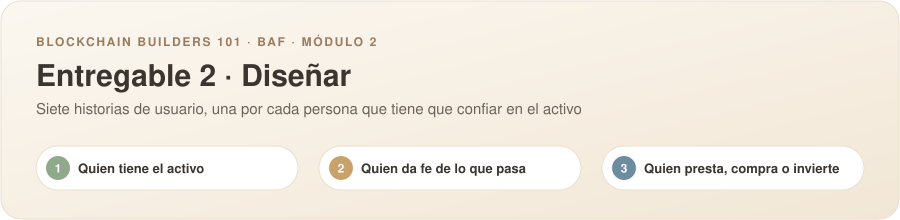
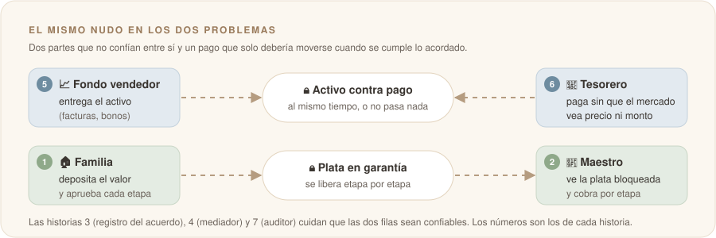

# Historias de usuario individuales

**Nombre:** Jairo Enrique Amaya Celis

**Usuario de GitHub:** [@jairoamayac](https://github.com/jairoamayac)

---

Trabajo sobre el problema que elegimos en el [Problem Brief](../semana1/ProblemBrief.md): **en una obra la plata sale antes de que alguien pueda verificar el trabajo, y cuando algo falla nadie puede probar qué se acordó, qué se hizo y qué se pagó.**

Escribí historias desde la familia que paga, el maestro que construye y quien tiene que verificar o mediar. Cada una apunta a una de las fricciones (F1 a F5) o a uno de los supuestos (S1 a S3) del Problem Brief.

---

## Mis historias de usuario

1. Como **familia que va a remodelar** quiero **dejar la plata de la obra en una garantía que solo se libera cuando yo apruebe cada etapa** para **no perder el anticipo si el maestro no cumple**.
2. Como **maestro de obra** quiero **ver que la plata del cliente ya está depositada y bloqueada antes de empezar** para **trabajar tranquilo, sabiendo que me van a pagar cada etapa que entregue**.
3. Como **familia o maestro** quiero **que lo que acordamos (etapas, montos, fechas y fotos del avance) quede registrado sin que nadie lo pueda cambiar** para **tener cómo probar lo que pasó si terminamos peleando**.
4. Como **mediador que la familia y el maestro escogieron al empezar la obra** quiero **revisar lo acordado y la evidencia de una etapa en disputa, y decidir si esa plata va para el maestro o vuelve a la familia** para **cerrar el conflicto en días y sin llegar a la SIC ni a un juez**.
5. Como **maestro de obra** quiero **que la plata de los materiales de cada etapa se le pague directamente a la ferretería desde la garantía** para **arrancar sin poner plata de mi bolsillo, y que la familia vea en qué se fue cada peso**.
6. Como **supervisor de una alcaldía que contrata una obra pequeña sin fiducia** quiero **aprobar cada acta de avance y que el pago al contratista salga solo contra el acta aprobada** para **proteger el anticipo de la obra pública sin pagar una fiducia que cuesta más que la obra**.
7. Como **familia o maestro que no sabe de tecnología** quiero **usar la garantía desde el celular, pagando y cobrando en pesos, sin claves ni palabras raras** para **que sea tan fácil como mandar un WhatsApp**.

### Vista por historia

| # | Rol | Lo que le quitamos | Fricción o supuesto que ataca |
|:-:|---|---|---|
| 1 | 🏠 Familia | Perder el anticipo si el maestro se va | **F1** El anticipo viaja sin respaldo |
| 2 | 🧱 Maestro | Trabajar semanas sin saber si la plata del saldo existe | **F4** El saldo se retiene o se regatea |
| 3 | 🏠🧱 Ambos | Que la pelea sea un chat contra otro | **F2** Nadie sabe cuánto va de verdad · **F5** La pelea no tiene pruebas |
| 4 | ⚖️ Mediador | Decidir sin pruebas o terminar en años de pleito | **F5** La pelea no tiene pruebas y dura años |
| 5 | 🧱 Maestro · 🔩 Ferretería | Mezclar la plata de materiales con la de mano de obra | **F3** La plata de materiales se mezcla · **S2** El maestro necesita el anticipo para materiales |
| 6 | 🏛️ Supervisor municipal | Anticipos de obra pública pequeña sin ningún respaldo | **F1** y el segmento de entrada: contratos de menor y mínima cuantía exentos de fiducia |
| 7 | 🏠🧱 Ambos | Que la tecnología sea la barrera | **Riesgo de adopción** del Problem Brief |

---

## Criterios de aceptación

<b>1 · Garantía para el anticipo (familia)</b>

- [ ] La familia crea un acuerdo con el valor total, las etapas, el porcentaje de cada etapa y la fecha esperada de cada una.
- [ ] Al depositar, la plata queda bloqueada y la familia ve el saldo en garantía y el estado de cada etapa.
- [ ] Ninguna etapa se le paga al maestro sin la aprobación de la familia o la decisión del mediador.
- [ ] Si una etapa se vence sin entrega, la familia puede pedir la devolución de lo que no se ha liberado.
- [ ] Cada movimiento (depósito, aprobación, pago, devolución) queda en el historial con fecha y monto.

<b>2 · Ver la plata bloqueada antes de empezar (maestro)</b>

- [ ] El maestro recibe una invitación al acuerdo y lo acepta antes de que la familia deposite.
- [ ] Antes de empezar, el maestro ve cuánta plata hay en garantía para su obra y que nadie la puede sacar sin seguir lo acordado.
- [ ] Cuando la familia aprueba una etapa, el maestro recibe el pago de esa etapa en minutos y una notificación.
- [ ] El maestro puede compartir un enlace que demuestra que la plata está en garantía, sin mostrar datos personales.

<b>3 · Acuerdo y evidencia que nadie puede cambiar (ambos)</b>

- [ ] Lo acordado (etapas, montos y fechas) queda fijo cuando las dos partes lo aceptan. Cualquier cambio necesita que ambas lo acepten y queda como una versión nueva.
- [ ] El maestro sube fotos del avance de cada etapa y cada foto queda con fecha.
- [ ] Las fotos y los datos personales se guardan fuera de la red; en la red solo queda su huella digital (hash).
- [ ] Cualquiera de las dos partes puede comprobar que una foto o el acuerdo no cambiaron desde que se registraron.
- [ ] Se puede descargar el historial completo de la obra como prueba.

<b>4 · Disputa resuelta por un mediador</b>

- [ ] El mediador queda definido en el acuerdo antes de empezar y las dos partes lo aceptan.
- [ ] La familia o el maestro pueden abrir una disputa sobre una etapa, explicando el motivo.
- [ ] Mientras hay disputa, la plata de esa etapa queda congelada y las demás etapas siguen su curso.
- [ ] El mediador ve el acuerdo, las fotos y el historial de esa etapa.
- [ ] Solo el mediador puede resolver: pagarle al maestro, devolverle a la familia o dividir el monto. Su decisión queda registrada con el motivo.

<b>5 · Materiales pagados directo a la ferretería</b>

- [ ] En el acuerdo se puede separar, por etapa, cuánto es para materiales y cuánto para mano de obra.
- [ ] El maestro carga la cotización de la ferretería y la familia la aprueba.
- [ ] Al aprobarse, el pago de materiales sale de la garantía directamente a la ferretería, sin pasar por el maestro.
- [ ] La familia ve en el historial qué se compró, a quién y por cuánto.
- [ ] Si la ferretería no está registrada, el pago no sale y el maestro recibe un aviso de qué falta.

<b>6 · Pago contra acta aprobada (obra pública pequeña)</b>

- [ ] La entidad registra el contrato con el anticipo, las etapas y el supervisor o interventor responsable.
- [ ] El contratista presenta el acta de avance de cada etapa con su evidencia.
- [ ] Solo el supervisor designado puede aprobar el acta, y solo con el acta aprobada sale el pago de esa etapa.
- [ ] Cualquier ciudadano puede consultar los montos, las actas aprobadas y los pagos del contrato, sin datos personales.
- [ ] El historial del contrato se puede exportar para la rendición de cuentas.

<b>7 · Fácil desde el celular y en pesos</b>

- [ ] La familia y el maestro se registran con su celular y su cédula, sin crear claves de 24 palabras ni instalar programas especiales.
- [ ] La familia deposita en pesos (PSE o transferencia) y el maestro recibe pesos en su cuenta o billetera digital.
- [ ] El acuerdo y el estado de las etapas se pueden compartir y consultar con un enlace por WhatsApp.
- [ ] Ninguna pantalla muestra términos técnicos como "blockchain", "token" o "contrato inteligente".
- [ ] Una persona que nunca ha usado la app puede crear un acuerdo de tres etapas en menos de cinco minutos.

---

## La más importante y por qué

| Orden de importancia | Historia # | Por qué |
| :---: | :---: | --- |
| 1 (la más importante) | 1 | Ataca la fricción de origen (F1): el anticipo que viaja sin respaldo. Si la plata queda en garantía y solo sale cuando la familia aprueba, desaparece el riesgo más grande y más humano del problema. |
| 2 | 2 | Es la otra mitad de la misma garantía. Si el maestro no ve que la plata existe antes de empezar, no tiene motivo para aceptar el sistema, y sin maestro no hay obra. |
| 3 | 7 | El Problem Brief marca la adopción como el riesgo principal: si no es tan simple como un WhatsApp, familias y maestros no lo van a usar. Por eso está por encima de las funciones que resuelven casos menos frecuentes. |
| 4 | 3 | Convierte la garantía en prueba (F2 y F5). Es lo que permite saber cuánto va la obra y qué se acordó, y casi sale solo cuando ya existen las historias 1 y 2. |
| 5 | 5 | Responde al supuesto más débil (S2): que el maestro necesite el anticipo libre para comprar materiales. Pagarle directo a la ferretería le resuelve eso sin quitarle la protección a la familia. |
| 6 | 4 | Las disputas van a pasar, pero no en cada obra. Al principio se pueden resolver con un mediador definido en el acuerdo, sin un flujo de mediación completo. |
| 7 (la menos importante) | 6 | Abre el segmento de entrada (obra pública pequeña sin fiducia), pero depende de una entidad pública y de sus procesos. Primero hay que probar el mecanismo con familias y maestros, que es nuestro laboratorio. |

> 🔍 **Lo que todavía tengo que validar en las entrevistas:** si los maestros aceptarían cobrar por etapas desde una garantía (S2), qué parte del anticipo se va normalmente en materiales, y si las peleas son por avance y pago o por calidad (S3).
